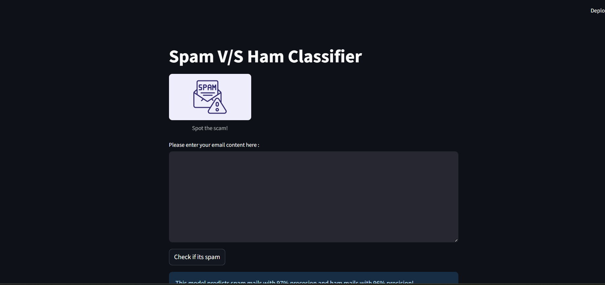

# Spam V/S Ham Classifier
This is a Machine Learning model that detects mails as **spam** or **not spam(ham)** using **NLP(Natural Language Processing)** and **scikit-learn**! Deployed with *streamlit*

## Features ##
- Trained using real-life dataset (access dataset here -> https://www.kaggle.com/datasets/jackksoncsie/spam-email-dataset)
- NLP : Tokenization, stopwords
- Deployed as webapp using streamlit

## Technologies ##
- CountVectorizer
- TF-IDF
- pandas, nltk, sklearn
- pickle for model saving

## Model Metrics ##
- **Accuracy**: 96%
- **Spam Precision**: 97%
- **Ham Precision**: 96%
- **Spam Recall**: 86%
- **Ham Recall**: 99%
- **F1 Score (Macro Avg)**: 0.94

## A Glimpse of the app ##

## Author ##
#### Poorvaja Joshi ###